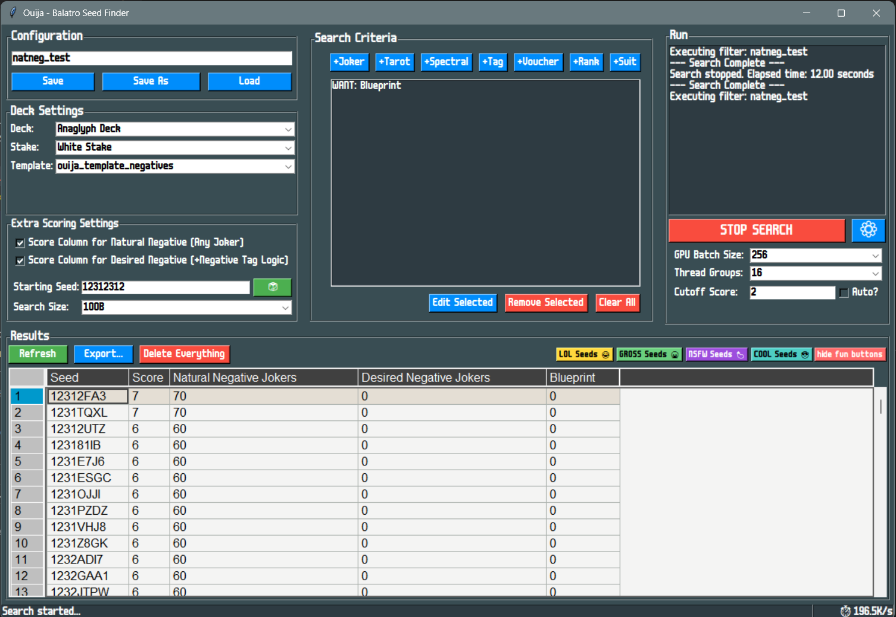

# Ouija v2.0 - Balatro Seed Finder

<div align="center">



**Advanced seed search and analysis tool for Balatro**

[](https://github.com/OptimusPi/ouija/releases)
[](#system-requirements)
[](#system-requirements)
[](LICENSE)

</div>

## 🎯 What is Ouija?

Ouija is a powerful, GPU-accelerated seed finder for **Balatro**, the acclaimed poker-inspired deckbuilding roguelike. It helps players discover specific seed configurations to enhance their gameplay experience through advanced filtering and real-time search capabilities.

### ✨ Key Features

- **🚀 GPU-Accelerated Search** - Blazing fast OpenCL-powered seed analysis
- **🎨 Modern UI** - Beautiful, intuitive graphical interface with dark theme
- **⚡ Real-time Results** - Live progress tracking and instant result display
- **📊 Advanced Filtering** - Complex search criteria for jokers, cards, and game mechanics
- **💾 Database Management** - Persistent storage and search history
- **📈 Export Capabilities** - Excel, CSV, and custom format support
- **🎛️ CLI Power Tools** - Command-line interface for advanced users and automation
- **🔧 Highly Configurable** - Extensive customization options

## 🏗️ Architecture

Ouija consists of three main components:

```
┌─────────────────┐                   ┌─────────────────┐
│   Ouija-UI      │                   │   Ouija-CLI     │
│   (Python/Tk)   │──> Json Config ──>│   (C/OpenCL)    │
│                 │                   │                 │
│ • Modern GUI    │                   │ • Seed Search   │
│ • Results DB    │                   │ • GPU Compute   │
│ • Data Export   │<── CSV Results <──│ • CSV Output    │
│ • Config Editor │                   │ • Metrics       │
└─────────────────┘                   └─────────────────┘
     |
     └──<──pandas dataframe──>──┐
                       ┌─────────────────┐
                       │ Ouija Datasbase │
                       │ • DuckDB History│
                       │                 │
                       │ • Search History│
                       │ • Config Storage│
                       └─────────────────┘    
```

## 📋 System Requirements

### Minimum Requirements
- **OS:** Windows 10/11 (64-bit)
- **GPU:** Modern graphics card with OpenCL 1.2+ support (2015 or newer)
- **Drivers:** Latest graphics drivers (NVIDIA/AMD/Intel)
- **Memory:** 4GB RAM
- **Storage:** 500MB free space

### Recommended
- **GPU:** Dedicated graphics card (GTX 1060/RX 580 or better)
- **Memory:** 8GB RAM or more
- **Storage:** SSD for faster database operations

### Supported GPUs
- **NVIDIA:** GTX 900 series and newer, RTX series (all)
- **AMD:** R9 200 series and newer, RX series (all), RDNA architecture
- **Intel:** HD Graphics 4000 and newer, Iris, Arc series

## 🚀 Quick Start

### Option 1: Professional Installer (Recommended)
1. **Download** `Ouija-v2.0.0-Setup.exe` from [Releases](https://github.com/OptimusPi/ouija/releases)
2. **Run** the installer and follow the modern GUI wizard
3. **Launch** from Start Menu or desktop shortcut
4. **Enjoy** your beautiful interface with professional installation!

### Option 2: Python GUI Installer (Advanced)
1. **Download** the source package or clone the repository
2. ~~**Run** `python modern-installer.py` or `run-python-installer.bat`~~
   **(Deprecated: Use the NSIS EXE installer instead)**
3. **Configure** interactive installation with GPU validation
4. **Install** with custom paths and advanced options

### Option 3: Manual Installation (Legacy)
1. Download `Ouija-v2.0.0-Windows.zip` from releases
2. Extract to your desired location  
3. Run `Install-Ouija.bat` for basic setup
4. Launch `Ouija-UI.exe` to get started

### Option 4: Build from Source
```powershell
# Clone the repository
git clone https://github.com/OptimusPi/ouija.git
cd ouija

# Build everything (requires Visual Studio Build Tools + Python)
.\build-release.ps1

# Or build components separately
cd Ouija-cli && .\build.ps1        # Build CLI engine
cd ../Ouija-ui && python build_exe.py  # Build UI executable
```

## 🎮 Usage Guide

### Graphical Interface (Recommended)

1. **Launch Ouija UI**
   ```powershell
   .\Ouija-UI.exe
   ```

2. **Create Your First Search**
   - Navigate to the **Configuration** tab
   - Define your search criteria (jokers, cards, scores)
   - Save your configuration with a descriptive name

3. **Run the Search**
   - Go to the **Search** tab
   - Select your configuration
   - Click **Start Search** and watch results appear in real-time

4. **Analyze Results**
   - View results in the **Results** tab
   - Sort, filter, and export findings
   - Save interesting seeds for later reference

### Command Line Interface (Advanced)

```powershell
# View all available options
.\Ouija-CLI.exe -h

# Basic seed search with configuration file
.\Ouija-CLI.exe ouija_configs\test.ouija.json

# List available GPU devices
.\Ouija-CLI.exe --list_devices

# Custom search parameters
.\Ouija-CLI.exe ouija_configs\test.ouija.json -s ABC12345 -n 1000000 -c 50 -b 200

# Performance tuning options
.\Ouija-CLI.exe ouija_configs\test.ouija.json -g 32 -b 150 -p 0 -d 1

# Use specific filter template
.\Ouija-CLI.exe ouija_configs\test.ouija.json -f ouija_template_anaglyph

# Auto-adaptive cutoff scoring
.\Ouija-CLI.exe ouija_configs\test.ouija.json -c auto
```

**Available CLI Options:**
- `-h` - Show help dialog
- `-f <filter>` - Set filter template (default: ouija_template)
- `-s <seed>` - Starting seed (use `-s random` for random seed)
- `-n <number>` - Number of seeds to search. NOTE: -n param value of `0` will compile Kernel Code and exit.
- `-c <score>` - Cutoff score (use "auto" for dynamic cutoff)
- `-p <id>` - OpenCL platform ID (default: 0)
- `-d <id>` - OpenCL device ID (default: 0)
- `-g <groups>` - Number of thread groups (default: 16)
- `-b <multiplier>` - Batch size multiplier (default: 100)
- `--config <file>` - Load configuration from JSON file
- `--list_devices` - List available OpenCL devices

### Configuration Examples

<details>
<summary>🃏 High-Value Joker Search</summary>

```json
{
  "maxSearchAnte": 8,
  "scoreNaturalNegatives": true,
  "scoreDesiredNegatives": false,
  "numNeeds": 2,
  "Needs": [
    {
      "value": "JOKER_BLUEPRINT",
      "jokeredition": "No_Edition"
    },
    {
      "value": "JOKER_BRAINSTORM", 
      "jokeredition": "No_Edition"
    }
  ],
  "numWants": 3,
  "Wants": [
    {
      "value": "JOKER_PERKEO",
      "jokeredition": "No_Edition"
    },
    {
      "value": "CARD_ACE_OF_SPADES",
      "jokeredition": "JOKER_POLYCHROME"
    },
    {
      "value": "JOKER_RIDE_THE_BUS",
      "jokeredition": "JOKER_HOLOGRAPHIC"
    }
  ]
}
```
</details>

<details>
<summary>🎯 Legendary Hunt Configuration</summary>

```json
{
  "maxSearchAnte": 12,
  "scoreNaturalNegatives": false,
  "scoreDesiredNegatives": true,
  "numNeeds": 1,
  "Needs": [
    {
      "value": "JOKER_CANIO",
      "jokeredition": "JOKER_NEGATIVE"
    }
  ],
  "numWants": 2,
  "Wants": [
    {
      "value": "JOKER_TRIBOULET",
      "jokeredition": "JOKER_POLYCHROME"
    },
    {
      "value": "JOKER_YORICK", 
      "jokeredition": "JOKER_HOLOGRAPHIC"
    }
  ]
}
```
</details>

## 📊 Performance Optimization

### GPU Settings
```powershell
# Find your optimal GPU configuration
.\Ouija-CLI.exe --list_devices

# Example output:
# Platform ID 0, Device ID 0
# Name: NVIDIA GeForce RTX 3070
# Compute Units: 46
# Clock Frequency: 1725MHz

# Use the best GPU (usually platform 0, device 0)
.\Ouija-CLI.exe -p 0 -d 0 -g 32 -b 200
```

### Batch Size Tuning
| GPU Tier | Recommended `-b` | Memory Usage | Performance |
|-----------|------------------|--------------|-------------|
| Entry (GTX 1060) | 50-100 | ~5MB | Good |
| Mid-range (RTX 3060) | 100-200 | ~10MB | Excellent |
| High-end (RTX 4080+) | 200-500 | ~25MB | Maximum |

### Search Strategies
- **Quick Exploration**: Use `-c auto` for dynamic cutoff adjustment
- **Comprehensive Search**: Set fixed cutoff `-c 1` with large `-n` values
- **Targeted Search**: Use specific starting seeds `-s SEED123`

## 🗂️ Project Structure

```
ouija/
├── 📱 Ouija-ui/          # Python GUI Application
│   ├── controllers/      # MVC Controllers
│   ├── models/          # Data Models
│   ├── views/           # UI Components
│   └── utils/           # Helper Functions
├── 💻 Ouija-cli/         # C/OpenCL Engine
│   ├── lib/             # Headers & Definitions
│   ├── ouija_filters/   # OpenCL Search Filters
│   └── build/           # Compiled Binaries
├── 🤖 Ouija-ai/          # AI Documentation
│   └── *.md             # Development Guidelines
├── 🔧 ouija_configs/     # Configuration Files
├── 💾 ouija_database/    # Search Result Storage
└── 📦 distribution/      # Release Packages
```

## 🛠️ Development

### Prerequisites
- **Visual Studio 2022** with C++ build tools
- **Python 3.8+** with pip
- **OpenCL SDK** (usually included with GPU drivers)
- **Git** for version control

### Building Components

```powershell
# Full automated build
.\build-release.ps1 -Clean

# Individual components
cd Ouija-cli
.\build.ps1                    # Build CLI engine

cd ../Ouija-ui  
pip install -r requirements.txt
python build_exe.py           # Build UI executable

# Create installer package
.\build-release.ps1           # Complete distribution
```

### Development Workflow
1. **Fork** the repository
2. **Create** a feature branch
3. **Make** your changes
4. **Test** with both UI and CLI
5. **Submit** a pull request

### Code Standards
- **C Code**: Follow K&R style, document GPU kernels
- **Python Code**: PEP 8 compliance, type hints preferred
- **Documentation**: Clear comments, update README for features

## 🔧 Configuration Reference

### Core Settings
| Parameter | Description | Default | Range |
|-----------|-------------|---------|-------|
| `maxSearchAnte` | Maximum ante to search | 8 | 1-12 |
| `scoreNaturalNegatives` | Include natural negative jokers | false | bool |
| `scoreDesiredNegatives` | Score desired negative jokers | false | bool |
| `numNeeds` | Required items count | 0 | 0-16 |
| `numWants` | Desired items count | 0 | 0-16 |

### CLI Parameters
| Flag | Description | Example |
|------|-------------|---------|
| `-c` | Score cutoff or 'auto' | `-c 50` |
| `-n` | Number of seeds to search | `-n 1000000` |
| `-s` | Starting seed | `-s ABC123` |
| `-b` | Batch multiplier | `-b 200` |
| `-g` | Thread groups | `-g 32` |
| `-p/-d` | Platform/Device ID | `-p 0 -d 1` |

## 🐛 Troubleshooting

### Common Issues

**"GPU doesn't support SVM" Error**
```powershell
# Check GPU compatibility
.\Ouija-CLI.exe --list_devices

# Solutions:
# 1. Update graphics drivers
# 2. Try different platform/device: -p 1 -d 0
# 3. Reduce batch size: -b 50
```

**UI Won't Start**
```powershell
# Run with admin privileges
# Check Windows Defender exclusions
# Verify all files extracted properly
```

**Slow Performance**
```powershell
# Monitor GPU usage in Task Manager
# Reduce batch size if overheating
# Check background applications
# Ensure adequate power supply
```

**No Results Found**
```powershell
# Lower cutoff score: -c 1
# Increase search range: -n 10000000  
# Try auto mode: -c auto
# Verify configuration file format
```

### Performance Monitoring
```powershell
# Check GPU utilization
Get-Counter "\GPU Engine(*)\Utilization Percentage"

# Monitor memory usage  
Get-Process Ouija-CLI | Select-Object WorkingSet64

# Temperature monitoring (if available)
nvidia-smi  # For NVIDIA GPUs
```

## 🤝 Contributing

We welcome contributions from the Balatro community! Here's how you can help:

### Ways to Contribute
- 🐛 **Report Bugs** - Use GitHub Issues with detailed reproduction steps
- 💡 **Suggest Features** - Share your ideas for new functionality  
- 🔧 **Submit Code** - Pull requests for bug fixes and enhancements
- 📚 **Improve Documentation** - Help make guides clearer
- 🎮 **Share Configurations** - Submit your successful search profiles
- 🧪 **Test Releases** - Help validate new versions

### Development Areas
- **GPU Optimization** - OpenCL kernel improvements
- **UI Enhancement** - New features and visual improvements  
- **Filter Development** - Custom search algorithms
- **Cross-platform** - Linux and macOS support
- **Performance** - Memory optimization and speed improvements

## 📜 License

This project is licensed under the **MIT License** - see the [LICENSE](LICENSE) file for details.

## 🙏 Acknowledgments

- **LocalThunk** - Creator of Balatro, the amazing game that inspired this tool
- **OpenCL Community** - For GPU computing frameworks and documentation
- **Balatro Speedrunning Community** - For testing, feedback, and feature requests
- **Contributors** - Everyone who has helped improve Ouija

## 📞 Support & Community

- **Issues**: [GitHub Issues](https://github.com/OptimusPi/ouija/issues)
- **Discussions**: [GitHub Discussions](https://github.com/OptimusPi/ouija/discussions)
- **Discord**: [Balatro Community Discord](https://discord.gg/balatro)
- **Documentation**: [Wiki](https://github.com/OptimusPi/ouija/wiki)

## 🚀 Roadmap

### v2.1 (Next Release)
- [ ] Linux and macOS support
- [ ] Improved result filtering algorithms
- [ ] Real-time search statistics
- [ ] Enhanced configuration editor

### v2.2 (Future)
- [ ] Cloud search collaboration
- [ ] Advanced visualization tools
- [ ] Machine learning seed prediction
- [ ] Mobile companion app

---

<div align="center">

**Built with ❤️ for the Balatro community**

*pifreak loves you! 🎰*

</div>
